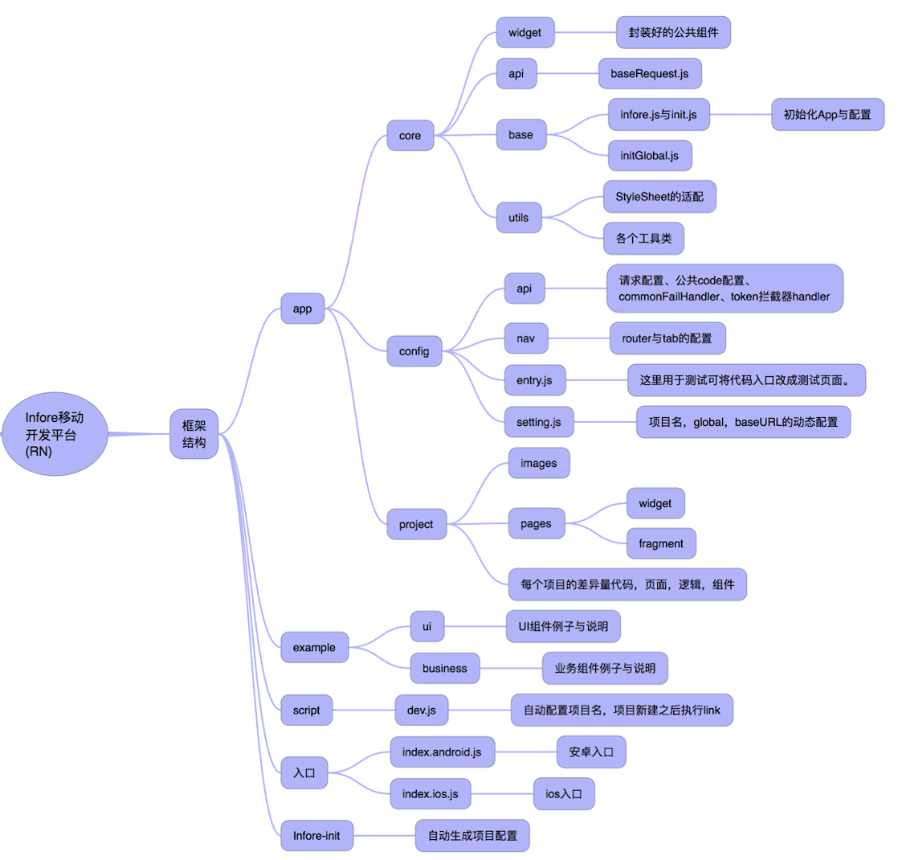
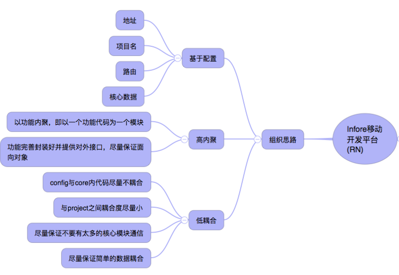
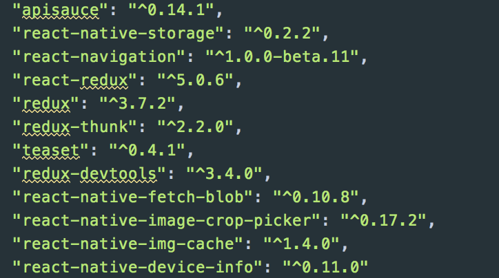
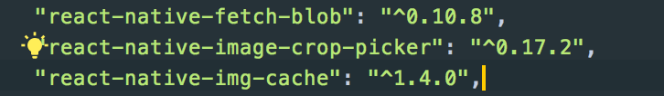
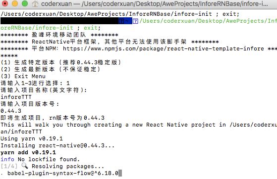
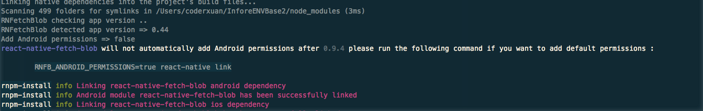

# react-native-template-infore 框架介绍

> 1. 代码组织说明
> 2. 组织思路
> 3. 依赖包
> 4. 开发流程

## 代码组织说明

## 组织思路

## 依赖包

* 在link之后还需要额外配置的包有：

* 大家参考github进行配置就好。

## 开发流程
> 1. 使用infore-init脚本新建项目

> 2. node运行项目目录下的脚本文件：node script/dev.js
> 3. 在脚本文件中已经进行了react-native link 的操作，但是可能会出现一个警告：

此时需要执行图中的命令。
> 然后需要手动将这几个包进行配置（Android和IOS都需要配置）

* 这几个库看github上的配置即可，注意Android、IOS的权限配置。
* IOS配置完pod之后即可运行在手机，注意要配置Camera和Photo的权限。
```$xslt
<key>NSCameraUsageDescription</key>
<string></string>
<key>NSMicrophoneUsageDescription</key>
<string></string>
<key>NSPhotoLibraryUsageDescription</key>
<string></string>
```

> * 项目生成之后既与框架包脱离关系属于独立项目，自己可随意改动。

> * Android 和 IOS 的打包和运行自己Google，不做过多说明。

> * 热更新暂未引入，如需使用见example示例，或者使用code-push

> * 项目内example为示例代码，react-native-template-infore为框架包，在npm上维护，如需升级请通过``npm publish --registry http://registry.npmjs.org ``指令进行包管理。

## 最后
项目已经移交npm<link>https://www.npmjs.com/react-native-template-infore</link>
大家也可以通过<br>
<strong>react-native install --template infore </strong><br>
来使用该项目。

<a href="https://nodei.co/npm/react-native-template-infore/"></a>

### 祝大家大吉大利，今晚吃鸡~
